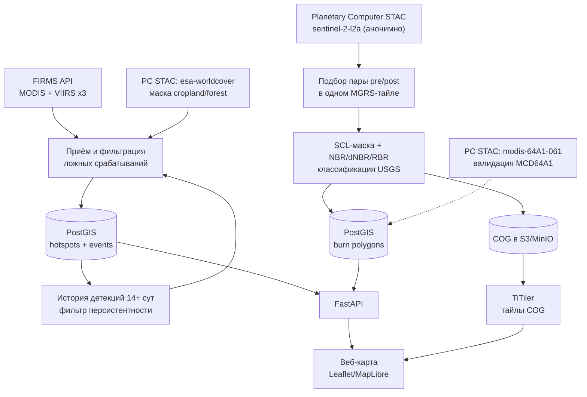

# Техническое задание: Оперативный мониторинг лесных пожаров (Красноярский край и Сибирь)

**Редакция 2** от 18.09.2026 — скорректировано под фактическую доступность данных.
Все источники проверены обращением к живым эндпоинтам 18.09.2026; результаты проверки — в разделе 14.

> Пометка **[ИЗМЕНЕНО]** — пункт исправлен относительно ред. 1, причина указана.
> Пометка **[УДАЛЕНО]** — требование снято как нереализуемое на доступных данных.
> Пометка **[ДОБАВЛЕНО]** — новое требование, вытекающее из ограничений данных.

---

## 1. Общие сведения

**Наименование системы:** «Оперативный мониторинг лесных пожаров» (рабочее название).

**Назначение.** Веб-сервис и API для оперативного обнаружения активных очагов лесных пожаров и картирования гарей на территории Красноярского края и Сибири по данным дистанционного зондирования Земли (ДЗЗ).

**Область применения.** Мониторинг лесопожарной обстановки для лесхозов, региональных служб, исследовательских и волонтёрских организаций, не имеющих доступа к закрытым ведомственным системам (ИСДМ-Рослесхоз, ВЕГА-Science).

**Принципиальное ограничение проекта.** Используются исключительно публично доступные данные и API — без интеграции с закрытыми российскими ведомственными системами, требующими регистрации через ЕСИА/Госуслуги или ведомственного согласования.

**[ДОБАВЛЕНО] Уточнение градаций доступности.** Ред. 1 трактовала «публично доступный» как единую категорию. Фактически источники делятся на три класса, и это влияет на архитектуру:

| Класс | Что значит | Источники |
|---|---|---|
| **A — анонимный** | работает из кода без учётных данных | Microsoft Planetary Computer STAC (Sentinel-2 L2A, Landsat C2, MCD64A1, MOD14A1, ESA WorldCover), Rosleshoz opendata (CSV) |
| **B — бесплатный ключ** | нужна разовая саморегистрация, ключ в env | NASA FIRMS (MAP_KEY), NASA Earthdata Login (архив FIRMS), CDSE (token), Copernicus CDS (ERA5), CEDA (Fire_CCI) |
| **C — лицензионное соглашение** | нужна заявка и одобрение правообладателя | VIIRS Nightfire (EOG, с 10.01.2025) |

**Требование:** оперативный контур сервиса (этапы 1–2) строится только на классах A и B. Источники класса C — опциональное обогащение, отсутствие которого не блокирует приёмку.

**География охвата.** Основной полигон — Красноярский край (bbox приблизительно 82°–109° в.д., 51°–78° с.ш.); архитектура должна допускать расширение на всю Сибирь без изменения кода (параметризация bbox/административных границ).

**[ДОБАВЛЕНО] Ограничение по широте.** Северная часть края (Таймыр, Северная Земля, выше ~66° с.ш.) в период с ноября по февраль находится в полярной ночи: оптические сенсоры Sentinel-2 и Landsat в это время не снимают вообще. Этап 2 (картирование гарей) для этой зоны физически неработоспособен зимой. Кроме того, снежный покров искажает NBR, что сужает рабочее окно до безснежного периода (ориентировочно июнь–сентябрь для севера края, май–октябрь для юга). Этап 1 (тепловые детекции) работает круглогодично и от освещённости не зависит.

---

## 2. Цели и задачи проекта

**Цель.** Создать работающий веб-сервис, который в течение первых 24–48 часов после старта показывает актуальные очаги горения и по завершении пожара — карту гари с оценкой площади поражения в гектарах, полностью на публичных данных.

**Задачи:**

1. **[ИЗМЕНЕНО]** Реализовать приём и фильтрацию данных активного огня (**MODIS/VIIRS** через NASA FIRMS) для территории Красноярского края. *Landsat исключён из этапа 1 — см. п. 3.1.*
2. Снизить долю ложных срабатываний (газовые факелы, сельхозпалы, промышленные теплоисточники) относительно baseline-алгоритма FIRMS.
3. Реализовать пайплайн картирования гарей по Sentinel-2 (dNBR/RBR) с классификацией тяжести повреждения.
4. **[ИЗМЕНЕНО]** Обучить/дообучить и сравнить с baseline модель детектирования на исторических открытых датасетах — **как исследовательский трек, не встроенный в оперативный контур** (обоснование в п. 7).
5. Предоставить результаты через REST API и веб-карту с отчётом по площади гари.

**Критерии успеха (MVP):**

- **[ИЗМЕНЕНО]** Сервис опрашивает FIRMS не реже раза в 3 часа и отображает все точки активного огня по Красноярскому краю, доступные на момент опроса. *Формулировка ред. 1 «отображает точки не реже раза в 3 часа» смешивала частоту опроса с частотой появления данных: новые детекции появляются только по пролётам спутников (для VIIRS на широтах 56–70° это ~4–6 пролётов в сутки), а не равномерно каждые 3 часа.*
- **[ИЗМЕНЕНО]** Доля исключённых известных ложных источников — 100% в зоне покрытия справочного слоя факелов, **при условии что слой сформирован**. Формирование слоя собственными силами требует ≥14 суток накопленной истории (см. ФТ-1.5), поэтому на момент запуска PoC критерий проверяется на bootstrap-слое из архива FIRMS за прошлый сезон, а не на живых данных.
- Для завершённого пожара сервис рассчитывает площадь гари по Sentinel-2 с точностью, сопоставимой с MCD64A1/Fire_CCI на контрольных участках (расхождение оценивается, а не гарантируется, ввиду систематических смещений обоих продуктов, см. раздел 11).
- API отдаёт GeoJSON точек и полигонов и агрегаты по площади за запрошенный период.
- **[ДОБАВЛЕНО]** Для пожаров, завершившихся вне безснежного/светлого окна, сервис корректно возвращает статус `deferred` с датой ожидаемого расчёта, а не ошибку и не нулевую площадь.

---

## 3. Источники данных (только публичные)

### 3.1. [ИЗМЕНЕНО] Этап 1 — активные очаги

| Источник | Доступ | Разрешение | Латентность | Статус |
|---|---|---|---|---|
| FIRMS `VIIRS_SNPP_NRT` | MAP_KEY (класс B) | 375 м | NRT 1–3 ч | **основной** |
| FIRMS `VIIRS_NOAA20_NRT` | MAP_KEY | 375 м | NRT 1–3 ч | **основной** |
| FIRMS `VIIRS_NOAA21_NRT` | MAP_KEY | 375 м | NRT 1–3 ч | **основной** |
| FIRMS `MODIS_NRT` | MAP_KEY | 1 км | NRT 1–3 ч | вспомогательный (FRP, преемственность с архивом с 2000 г.) |
| ~~FIRMS `LANDSAT_NRT`~~ | — | — | — | **[УДАЛЕНО]** |

**[УДАЛЕНО] Обоснование исключения LANDSAT_NRT.** Продукт Landsat Fire and Thermal Anomalies формируется только из данных прямого приёма наземной станции USGS EROS (Су-Фолс, Южная Дакота) и покрывает исключительно CONUS, юг Канады и север Мексики. Для Красноярского края данных нет и не появится в рамках текущей конфигурации продукта. В ред. 1 источник фигурировал в таблице раздела 3 и в ФТ-1.1 — требование было неисполнимо.

**[ИЗМЕНЕНО] Технические лимиты FIRMS** (ред. 1 содержала неверные значения):

- `DAY_RANGE` — **1..5 суток** за один запрос (в ред. 1 и в исходном исследовании указано 1..10 — неверно).
- Лимит MAP_KEY — **5000 транзакций / 10 минут**. При 4 источниках × 1 запрос / 3 часа расход составляет ~32 транзакции в сутки; квота не является ограничивающим фактором, и требование «снижать частоту опроса при приближении к лимиту» (раздел 12 ред. 1) практически не будет срабатывать. Мониторинг квоты сохраняется как страховка.
- Через API/текстовые файлы доступны **последние 2 месяца**. Более глубокая ретроспектива — только через FIRMS Archive Download, **требующий NASA Earthdata Login** (класс B). Это влияет на bootstrap маски факелов (ФТ-1.5) и на формирование контрольной выборки (раздел 13).
- Глубина архива: MODIS с ноября 2000 (Terra) / июля 2002 (Aqua), VIIRS SNPP с 20.01.2012, VIIRS NOAA-20 с 01.01.2020.

### 3.2. [ИЗМЕНЕНО] Этап 2 — картирование гарей. Приоритет источников инвертирован

Ред. 1 назначала CDSE основным источником Sentinel-2, а Planetary Computer — резервным. **Приоритет меняется на обратный.**

| Источник | Доступ | Роль |
|---|---|---|
| **Microsoft Planetary Computer**, коллекция `sentinel-2-l2a` | **анонимный STAC (класс A)**, подпись ассетов через `planetary_computer.sign` | **основной** |
| Copernicus Data Space Ecosystem, `sentinel-2-l2a` | STAC читается анонимно, **скачивание продуктов требует access token** (класс B) | резервный |
| AWS Open Data `sentinel-cogs` (Element84 Earth Search) | анонимный STAC + COG | второй резерв |

**Обоснование инверсии.** Проверка 18.09.2026: запрос к `https://planetarycomputer.microsoft.com/api/stac/v1/search` по bbox Красноярского края возвращает HTTP 200 и валидные items без каких-либо учётных данных. В том же каталоге, тем же анонимным протоколом, доступны ещё четыре набора, которые ред. 1 планировала тянуть из четырёх разных мест с четырьмя разными регистрациями (LP DAAC/Earthdata, CEDA, esa-worldcover.org). Один анонимный STAC вместо четырёх регистраций — существенное упрощение ingestion-слоя и снятие целого класса операционных рисков (протухшие токены, смена условий регистрации).

**[ИЗМЕНЕНО] Состав ассетов Sentinel-2 L2A в Planetary Computer** (проверено):
`B01, B02, B03, B04, B05, B06, B07, B08, B8A, B09, B11, B12, SCL, AOT, WVP` + метаданные + `visual`.

Существенно: **ассета с вероятностью облачности s2cloudless (CLP/CLM) в каталоге нет.** Ред. 1 в ФТ-2.4 прямо предписывала s2cloudless. См. исправление ФТ-2.4.

### 3.3. [ДОБАВЛЕНО] Вспомогательные слои — все через тот же анонимный STAC

| Коллекция PC | Назначение | Лицензия | Покрытие Красноярского края |
|---|---|---|---|
| `esa-worldcover` | **маска сельхозземель** (класс 40 Cropland) для ФТ-1.6, маска лесов (класс 10 Tree cover) вместо недоступных границ лесного фонда | **CC-BY-4.0** | проверено, есть |
| `modis-64A1-061` | MCD64A1 Burned Area — **валидация площади гари без Earthdata Login** | — | проверено, есть (assets: `Burn_Date`, `Burn_Date_Uncertainty`, `First_Day`, `Last_Day`, `QA`) |
| `modis-14A1-061` / `modis-14A2-061` | MOD14 Thermal Anomalies — ретроспективная сверка детекций | — | с 18.02.2000 |
| `landsat-c2-l2` | тепловой канал `ST_B10`, ретроспектива для обучения | — | с 22.08.1982 |
| `hls2-s30` / `hls2-l30` | гармонизированный 30 м продукт, уплотнение временного ряда | — | есть |
| `cop-dem-glo-30` | рельеф (топография для интерпретации распространения) | — | есть |

**Ограничение ESA WorldCover:** доступны только эпохи 2020 и 2021, набор не обновляется. Для маски сельхозземель это приемлемо (землепользование меняется медленно), но слой статичен и требует ручного пересмотра раз в несколько лет. Сезонность маски (ФТ-1.6) реализуется не через смену слоя, а через календарное окно применения.

### 3.4. [ИЗМЕНЕНО] Метео и индексы пожарной опасности — исключены из оперативного контура

| Источник | Заявлено в ред. 1 | Фактически |
|---|---|---|
| ERA5 / Copernicus CDS | «погодные переменные» без оговорок | **латентность 5 суток** (ERA5T — предварительные данные, финальные через 2–3 месяца). Для оперативного мониторинга непригоден. |
| CEMS Fire Danger Indices (GEFF/ERA5) | «индекс пожарной опасности» | исторический датасет, наследует латентность ERA5 |

**Решение:** ERA5 и CEMS FWI переводятся из оперативного контура в **ретроспективный/исследовательский**: обучение моделей, постфактум-анализ сезона, объяснение аномалий. Если в интерфейсе нужен оперативный индекс пожарной опасности, потребуется отдельный источник прогнозных (не реанализных) данных — это вне MVP.

### 3.5. Справочные и валидационные источники

| Источник | Доступ | Проверено 18.09.2026 |
|---|---|---|
| **MODIS MCD64A1 C6.1** | **[ИЗМЕНЕНО]** через PC STAC анонимно (`modis-64A1-061`), а не через LP DAAC + Earthdata | доступен |
| **ESA Fire_CCI** (FireCCI51, FireCCISFD20) | CEDA, **требует бесплатной регистрации** (класс B) | — |
| **Global Fire Atlas** | ORNL DAAC / Zenodo | — |
| **Рослесхоз, открытые данные** | публичный CSV, без регистрации | **портал работает**, 38 наборов; профильные: №9 (число пожаров на землях лесфонда), №17 «Площадь лесных земель, пройденная пожарами», №18 (площадь на удалённых территориях). Содержательные данные — **за 2023 г.**; последние обновления паспортов — 17.06.2026. Годится как годовая справка, **не как оперативный источник** |
| **VIIRS Nightfire (EOG)** | **[ИЗМЕНЕНО]** с 10.01.2025 распространяется по VIIRS Nightfire Data Use License, требуется подача заявки (**класс C**) | портал работает, доступ через лицензию |

**[ИЗМЕНЕНО] Административные границы.** Ред. 1 неявно предполагала GADM (по аналогии с GFW). **GADM запрещает коммерческое использование.** Для сервиса, который может выйти за рамки академического применения, использовать **geoBoundaries** (полностью открытая лицензия) или **Natural Earth** (public domain), либо OSM (ODbL, требует share-alike). Выбор фиксируется до этапа 3.

**[ИЗМЕНЕНО] Границы лесного фонда РФ** (раздел 10 ред. 1, «справочные слои»). Открытого геопространственного слоя границ лесного фонда в публичном доступе нет. Заменяется на маску древесного покрова: `esa-worldcover` класс 10 (Tree cover) или Hansen Global Forest Change. В интерфейсе слой переименовывается в «Лесной покров», чтобы не вводить в заблуждение относительно юридического статуса земель.

### 3.6. Явно исключено

**ИСДМ-Рослесхоз** (nffc.aviales.ru — портал отвечает, но доступ преимущественно через ЕСИА), **ВЕГА-Science ИКИ РАН** (sci-vega.ru — **на 18.09.2026 не отвечает**; в любом случае научный доступ, не открытое API). Их публичная статистика может использоваться только как справочная величина для ручной сверки, а не как программный источник.

---

## 4. Архитектура системы

Система состоит из двух независимых, но связанных общей БД конвейеров: детектирование очагов (этап 1) и картирование гарей (этап 2), плюс общий слой хранения, API и веб-интерфейс.

**Компоненты:**

1. **Ingestion-слой** — периодические задачи (cron/Airflow), опрашивающие FIRMS Area API по bbox края и STAC-каталог Planetary Computer.
2. **Слой обработки этапа 1** — фильтрация confidence, маска известных газовых факелов, фильтр временной персистентности (требует накопленной истории), маска сельхозземель из WorldCover.
3. **Слой обработки этапа 2** — подбор пар до/после пожара в пределах одного MGRS-тайла, SCL-маскирование, расчёт NBR/dNBR/RBR, пороговая классификация тяжести.
4. **Хранилище** — PostGIS для векторных данных, объектное хранилище (S3/MinIO) для растров в формате COG.
5. **API-слой** — FastAPI поверх PostGIS, TiTiler для растровых тайлов.
6. **Веб-интерфейс** — карта на Leaflet/MapLibre с двумя слоями и панелью отчёта.

**[ДОБАВЛЕНО] Архитектурное следствие фильтра персистентности.** Поскольку FIRMS отдаёт максимум 5 суток за запрос, а фильтр персистентности требует окна ≥14 суток, **база данных с накопительной историей детекций обязательна с первого дня работы** — она не является оптимизацией и не может быть отложена на этап 1. Вариант «ходить в FIRMS на каждый запрос без хранения» технически невозможен.

---

## 5. Функциональные требования — Этап 1: детектирование очагов

**ФТ-1.1 [ИЗМЕНЕНО].** Система должна опрашивать NASA FIRMS Area API по источникам `MODIS_NRT`, `VIIRS_SNPP_NRT`, `VIIRS_NOAA20_NRT`, `VIIRS_NOAA21_NRT` для bbox Красноярского края с периодичностью не реже раза в 3 часа, с параметром `DAY_RANGE=2` (перекрытие окна для устойчивости к пропускам опроса). *Источник `LANDSAT_NRT` исключён — нет покрытия по России. `DAY_RANGE` не может превышать 5.*

**ФТ-1.2.** Для каждой полученной точки сохраняются: координаты, яркостная температура, FRP (МВт), confidence, дата/время (UTC), источник (сенсор), день/ночь.

**ФТ-1.3 [ИЗМЕНЕНО].** Система должна исключать точки с `confidence=low` по умолчанию (настраиваемый порог). *Уточнение: шкалы confidence у сенсоров разные — VIIRS отдаёт категориальную `l`/`n`/`h`, MODIS — числовую 0–100. Требуется нормализация к единой трёхуровневой шкале на этапе приёма, порог для MODIS задаётся отдельным параметром.*

**ФТ-1.4 [ИЗМЕНЕНО].** Система должна применять маску известных промышленных теплоисточников (газовые факелы) в виде справочного слоя. **Источник слоя, в порядке приоритета:**
   1. Собственный слой, вычисленный по персистентности (ФТ-1.5) на архиве FIRMS за один полный предшествующий год (требуется Earthdata Login для архивной выгрузки).
   2. Слой, вычисленный по персистентности на живых данных — доступен **не ранее чем через 14 суток** после запуска.
   3. Каталог VIIRS Nightfire (EOG) — **опционально**, требует подачи заявки на лицензию; отсутствие не блокирует приёмку.

   *В ред. 1 VIIRS Nightfire указывался как основной источник маски; с 10.01.2025 он перешёл под лицензионное соглашение и не может быть единственным путём выполнения требования.*

**ФТ-1.5 [ИЗМЕНЕНО].** Система должна применять фильтр временной персистентности: точки, детектируемые в одной локации (радиус ~500 м) на протяжении >14 дней без изменения интенсивности, помечаются как вероятный промышленный источник и исключаются из основного слоя (с возможностью просмотра в отдельном «служебном» слое).

**Реализационное ограничение:** окно в 14 дней **не может быть получено одним запросом к FIRMS** (максимум 5 суток). Фильтр работает по собственной накопленной истории в PostGIS. Следствия: (а) БД обязательна с первого дня; (б) на живых данных фильтр даёт первые результаты через 14 суток после запуска; (в) для работы фильтра с момента запуска необходим bootstrap из архива FIRMS.

**ФТ-1.6 [ИЗМЕНЕНО].** Система должна применять сезонную маску сельхозземель на основе **ESA WorldCover (коллекция `esa-worldcover` в Planetary Computer), класс 40 «Cropland», разрешение 10 м, лицензия CC-BY-4.0**. Сезонность реализуется календарным окном применения маски (весенние и осенние палы), а не сменой слоя: WorldCover статичен (эпохи 2020/2021) и обновлений не получает.

**ФТ-1.7.** Отфильтрованные и подтверждённые точки сохраняются в PostGIS с историей изменений (append-only) для последующего построения треков пожаров.

**ФТ-1.8.** Точки группируются в кластеры («события») по пространственно-временной близости для отображения на карте как единого очага.

**ФТ-1.9 [ДОБАВЛЕНО].** Система не должна интерпретировать отсутствие новых детекций как затухание пожара без учёта наличия наблюдений: необходимо различать «пролёт был, огня нет» и «пролёта/валидного наблюдения не было». Для этого сохраняется журнал успешных опросов по каждому источнику, а событие переводится в статус «завершено» только при наличии подтверждённых наблюдений без детекций.

---

## 6. Функциональные требования — Этап 2: картирование гарей

**ФТ-2.1 [ИЗМЕНЕНО].** По завершении событий этапа 1 (отсутствие новых точек в кластере ≥7 дней при наличии наблюдений, см. ФТ-1.9) система автоматически инициирует поиск пар сцен Sentinel-2 L2A «до» и «после» пожара через STAC API **Planetary Computer** (резерв — CDSE).

**Критерий отбора сцен изменён.** Ред. 1 требовала облачность ≤20% — это поле `eo:cloud_cover`, относящееся ко **всему тайлу 110×110 км**, а не к области пожара. В условиях сибирского пожароопасного сезона (дым от самих пожаров плюс типичная облачность) такой фильтр отсечёт подавляющее большинство сцен и пары не найдутся. Новая процедура:

   1. Предварительный отбор по `eo:cloud_cover ≤ 60%` (широкий фильтр).
   2. Чтение окна SCL по bbox пожара, расчёт **доли валидных пикселей внутри AOI**.
   3. Принятие сцены при доле валидных пикселей **≥80% внутри AOI** (порог настраиваемый).
   4. Выбор пары с максимальной суммарной долей валидных пикселей.

**ФТ-2.1.1 [ДОБАВЛЕНО].** Сцены «до» и «после» **обязаны принадлежать одному MGRS-тайлу** (`s2:mgrs_tile`). Сцены разных тайлов имеют разные UTM-зоны и растровые сетки; поэлементное вычитание NBR без перепроецирования даст неверный результат. При отсутствии пары в одном тайле — либо перепроецирование к общей сетке с явной фиксацией метода ресемплинга, либо отказ с диагностикой.

**ФТ-2.1.2 [ДОБАВЛЕНО]. Сезонное окно.** Поиск сцены «после» ведётся в окне +5…+60 суток от завершения события, но **не выходя за пределы безснежного и светового периода** для широты пожара. Если окно исчерпано (пожар завершился поздней осенью, зашёл в полярную ночь или под снег), событие получает статус `deferred` с расчётной датой возобновления в следующем сезоне. Возврат нулевой или частичной площади в такой ситуации недопустим.

**ФТ-2.2 [ИЗМЕНЕНО].** Система рассчитывает `NBR = (NIR − SWIR) / (NIR + SWIR)`, затем `dNBR = NBR_до − NBR_после` и `RBR = dNBR / (NBR_до + 1.001)`.

**Конкретизация каналов:** используются **B8A (865 нм, 20 м)** и **B12 (2190 нм, 20 м)**. *Ред. 1 указывала абстрактные NIR/SWIR, но при этом фиксировала площадь пикселя 20 м (ФТ-2.6) — это согласуется только при B8A. Использование B08 (842 нм, 10 м) потребовало бы ресемплинга B12 и изменило бы площадь пикселя на 0.01 га.* Значения приводятся делением на 10000; нулевые значения трактуются как nodata.

**ФТ-2.3 [ИЗМЕНЕНО].** Классификация тяжести повреждения по порогам USGS: Unburnt ≤0.10, Low 0.10–0.27, Moderate-low 0.27–0.44, Moderate-high 0.44–0.66, High >0.66 (пороги настраиваемые).

**[ДОБАВЛЕНО] Оговорка о калибровке.** Пороги USGS откалиброваны преимущественно на Landsat и на растительности запада США. Для сибирских лиственничных и тёмнохвойных насаждений они не валидированы. Пороги обязаны быть параметром конфигурации, а не константой, и при накоплении контрольных данных подлежат локальной перекалибровке. Результаты расчёта сохраняются вместе с версией набора порогов.

**ФТ-2.4 [ИЗМЕНЕНО].** Система применяет маску облаков, теней, снега и дыма **на основе штатного канала SCL (Scene Classification Layer, 20 м)**, исключая классы: 0 (nodata), 1 (saturated), 3 (cloud shadow), 8 (cloud medium probability), 9 (cloud high probability), 10 (thin cirrus), 11 (snow/ice). Пиксели под маской исключаются из статистики площади.

*Ред. 1 предписывала s2cloudless. Проверка каталога Planetary Computer показала: ассета с вероятностью облачности (CLP/CLM) у коллекции `sentinel-2-l2a` нет. Варианты применения s2cloudless: (а) запуск модели `s2cloudless` самостоятельно поверх бэндов — дополнительная зависимость и вычислительная нагрузка; (б) получение CLP через Sentinel Hub / CDSE — учётные данные класса B. Оба варианта выносятся за рамки MVP; SCL достаточен для приёмки.*

**ФТ-2.5.** Результат сохраняется как растровый файл (COG) и как векторизованные полигоны по классам тяжести в PostGIS.

**ФТ-2.6.** Площадь гари рассчитывается в гектарах по каждому классу тяжести (площадь пикселя 20 м × 20 м = 0.04 га) и агрегируется по кластеру/событию и по административной единице.

**ФТ-2.6.1 [ДОБАВЛЕНО].** Площадь вычисляется в **нативной проекции сцены (UTM)**, до какого-либо перепроецирования в EPSG:4326. Перепроецирование в географические координаты выполняется только для визуализации. Наряду с площадью по классам возвращается **доля пикселей AOI, исключённых маской** — без неё оценка площади не интерпретируема.

**ФТ-2.7.** Результат картирования гари привязывается к исходному событию этапа 1 (единый идентификатор пожара), обеспечивая сквозной путь «обнаружение → гарь → отчёт».

---

## 7. Модели детектирования: baseline и план улучшений

**Baseline.** Используются штатные контекстные алгоритмы MODIS (MOD14/MYD14) и VIIRS (VNP14), применённые NASA при формировании продукта FIRMS — система не переизобретает детектирование на сыром сигнале, а работает поверх готовых точек, добавляя постобработку (раздел 5).

**Известные ограничения baseline применительно к Сибири:**

- Газовые факелы (Ханты-Мансийск и другие нефтегазовые районы Западной Сибири) горят при температуре ~1800 K — вдвое горячее биомассы — и штатными алгоритмами MOD14/VNP14 отсеиваются плохо.
- Малые пожары (<100 га) систематически недодетектируются продуктами на основе MODIS.
- Лиственничные пожары дают экстремально высокий FRP (до 260 000 МВт), что требует отдельной калибровки порогов «экстремального» события.

**[ИЗМЕНЕНО] План улучшений.** Пункты 1–2 и 4 сохраняются, пункты 3 и 5 переклассифицированы.

1. **Маска газовых факелов** — по персистентности (ФТ-1.5); сверка с VIIRS Nightfire — опционально, при получении лицензии.
2. **SWIR-дискриминация температуры источника** — **[ИЗМЕНЕНО]** реализуема, но не на точках FIRMS: требует сырой радиометрии. Доступный путь — SWIR-каналы Sentinel-2 (B11/B12) и Landsat C2 L1 через анонимный STAC Planetary Computer. Применимо ретроспективно для построения/уточнения маски факелов, **не в оперативном контуре** (повтор Landsat 8–16 суток, Sentinel-2 ~5 суток, что несовместимо с 3-часовым циклом).
3. **Дообучение U-Net (pereira-gha/activefire)** — **[ИЗМЕНЕНО] переводится в исследовательский трек.** Обоснование: модель работает по сценам Landsat-8, а продукт FIRMS `LANDSAT_NRT` по Сибири отсутствует (п. 3.1). Даже успешно дообученная модель не сможет питать оперативную карту — сцены Landsat над краем появляются раз в 8–16 суток. Ценность трека — научная (сравнение с baseline на отложенной сибирской выборке) и как задел под ретроспективный переанализ, но **на оперативные метрики MVP он не влияет и из критериев приёмки MVP исключается**.
4. **Мультисенсорное слияние** — **[ИЗМЕНЕНО]** MODIS + VIIRS (три аппарата) в оперативном контуре; Landsat и Sentinel-2 — как ретроспективное уплотнение, не как источник NRT-детекций.
5. **ML-сегментация гарей** — **[ИЗМЕНЕНО]** наиболее перспективное направление ML в проекте, поскольку этап 2 не привязан к NRT-латентности и работает на тех же данных, что и пороговый метод. Начинать после накопления собственного размеченного массива по Сибири.

**Критерий перехода:** пороговый/rule-based подход используется, пока доля ложных срабатываний на контрольной выборке (раздел 13) не превышает 10%; при превышении приоритет отдаётся шагам 1–2.

---

## 8. Технологический стек

| Слой | Технология | Назначение |
|---|---|---|
| Приём данных | Python, httpx/requests (FIRMS), **pystac-client + planetary-computer** | опрос FIRMS и STAC-каталога PC |
| Оркестрация | Apache Airflow (или cron на старте MVP) | расписание опроса и обработки |
| Геообработка | Rasterio, GDAL, xarray/rioxarray | расчёт NBR/dNBR, работа с COG |
| ML *(исследовательский трек)* | PyTorch, fork pereira-gha/activefire | сегментация активного огня / гари |
| Векторное хранилище | PostgreSQL + PostGIS | точки, кластеры, полигоны гарей, статистика |
| Каталог сцен | **[ИЗМЕНЕНО]** pgSTAC — **опционально** | собственный индекс сцен нужен только при переходе на локальное зеркалирование; при работе через PC STAC избыточен |
| Объектное хранилище | S3-совместимое (MinIO для self-hosted) | растры в формате COG |
| Тайл-сервер | TiTiler (FastAPI + Rasterio/GDAL) | динамическая нарезка тайлов из COG |
| Backend API | FastAPI | REST API поверх PostGIS |
| Frontend | Leaflet или MapLibre GL | карта с двумя слоями и панелью отчёта |
| Контейнеризация | Docker / docker-compose | воспроизводимое развёртывание |

**[ДОБАВЛЕНО] Обязательная зависимость:** пакет `planetary-computer` — ассеты Planetary Computer требуют подписи URL (SAS-токен) перед чтением через Rasterio/GDAL; прямое обращение к href без подписи вернёт 404/403. Токены короткоживущие, поэтому подпись выполняется непосредственно перед чтением, а не кэшируется.

---

## 9. Спецификация REST API

| Метод | Путь | Описание | Формат |
|---|---|---|---|
| GET | `/api/v1/hotspots` | Активные очаги за период (`bbox`, `date_from`, `date_to`, `min_confidence`) | GeoJSON FeatureCollection |
| GET | `/api/v1/hotspots/{event_id}` | Детали события/кластера, история точек | GeoJSON + метаданные |
| GET | `/api/v1/burns` | Полигоны гарей за период (`bbox`, `date_from`, `date_to`, `severity_class`) | GeoJSON FeatureCollection |
| GET | `/api/v1/burns/{event_id}` | Детали гари: площадь по классам, ссылка на событие этапа 1 | JSON |
| GET | `/api/v1/stats/area` | Агрегированная площадь гари в га по административной единице и периоду | JSON |
| GET | `/tiles/hotspots/{z}/{x}/{y}.png` | Тайлы очагов | PNG/MVT |
| GET | `/tiles/burns/{z}/{x}/{y}.png` | Тайлы гарей по классам тяжести | PNG/MVT |
| GET | `/api/v1/health` | Статус пайплайнов приёма данных | JSON |
| **GET** | **`/api/v1/flares`** | **[ДОБАВЛЕНО]** Служебный слой отфильтрованных персистентных источников — необходим для аудита работы фильтра и разбора жалоб на пропущенный пожар | GeoJSON |

**Формат точки в `/api/v1/hotspots`:** координаты, `frp` (МВт), `confidence`, `sensor`, `acq_datetime` (UTC), `event_id`.

**[ИЗМЕНЕНО] Формат полигона в `/api/v1/burns`:** геометрия, `severity_class`, `area_ha`, `event_id`, `scene_before_date`, `scene_after_date` + **[ДОБАВЛЕНО]** `mgrs_tile`, `masked_fraction` (доля пикселей AOI под маской облаков/снега), `thresholds_version` (версия набора порогов классификации), `status` (`ok` | `deferred` | `failed`).

**[ИЗМЕНЕНО] Формат `/api/v1/health`:** по каждому источнику — время последнего **успешного** опроса, время последней **полученной детекции** (это разные величины: успешный опрос может вернуть пусто), статус квоты MAP_KEY, число событий в статусе `deferred`.

Аутентификация на MVP не требуется; при необходимости ограничения нагрузки — rate limiting по IP на уровне reverse-proxy.

---

## 10. Веб-интерфейс

Базовая карта — Leaflet или MapLibre GL, центрирована на Красноярский край, с возможностью переключения региона.

**Слои:**

- **Активные очаги** — точки/кластеры, цветокодирование по FRP или confidence; клик открывает карточку события.
- **Гари** — полигоны с цветокодированием по классу тяжести; клик открывает карточку с площадью по классам в гектарах **[ДОБАВЛЕНО]** и с долей площади под маской облаков.
- **Справочные слои** (опционально) — **[ИЗМЕНЕНО]** персистентные теплоисточники (служебный слой), **лесной покров** (ESA WorldCover класс 10 — *не границы лесного фонда, открытого слоя которых не существует*), сельхозземли (WorldCover класс 40), административные границы (geoBoundaries / Natural Earth).

**Панель отчёта.** Выбор периода и/или административной единицы → таблица и диаграмма распределения площади гари по классам тяжести в гектарах, экспорт в CSV/GeoJSON.

**Статус системы.** Индикатор времени последнего обновления по каждому источнику из `/api/v1/health`. **[ДОБАВЛЕНО]** Отдельно отображается: (а) число событий в статусе `deferred` с пояснением причины (полярная ночь / снежный покров / нет безоблачной пары); (б) предупреждение в период с ноября по февраль о недоступности картирования гарей севернее ~66° с.ш.

Интерфейс — тонкий клиент, вся логика агрегации выполняется на backend.

---

## 11. Данные для обучения и валидации моделей

| Датасет | Назначение | Доступ |
|---|---|---|
| **MODIS MCD64A1 C6.1** | Валидация площади гари | **[ИЗМЕНЕНО]** PC STAC `modis-64A1-061`, **анонимно** |
| **MOD14A1 / MOD14A2** | Ретроспективная сверка детекций | **[ДОБАВЛЕНО]** PC STAC `modis-14A1-061`, анонимно |
| **Landsat C2 L2 (ST_B10)** | Ретроспектива теплового канала, обучение | **[ДОБАВЛЕНО]** PC STAC `landsat-c2-l2`, анонимно, с 1982 г. |
| ESA Fire_CCI (FireCCI51, FireCCISFD20) | Валидация площади гари | CEDA, **бесплатная регистрация** |
| Pereira Landsat-8 (146k+9k патчей) | Дообучение U-Net — **исследовательский трек** | github.com/pereira-gha/activefire |
| Sen2Fire (2 466 патчей, 13 каналов) | Референс методологии (Австралия, **не бореальный**) | zenodo.org/records/10881058 |
| TS-SatFire (3 552 снимка) | Мультизадачное обучение | публикация |
| Global Fire Atlas | Индивидуальные пожары: очаг, размер, длительность | globalfiredata.org, ORNL DAAC |
| **FIRMS Archive** | **[ДОБАВЛЕНО]** Bootstrap маски факелов и контрольная выборка | **требует NASA Earthdata Login** |
| Рослесхоз, открытые данные | Годовая справка по краю | публичный CSV, **данные за 2023 г.** |

**Важное ограничение точности валидации.** MCD64A1 систематически недооценивает площадь малых пожаров (для бореальной Евразии — низкая доля обнаружения для очагов <100 га), а FireCCI51 их, напротив, переоценивает. Расхождение необходимо учитывать явно, а не трактовать как ошибку одной из сторон.

**[ДОБАВЛЕНО] Дополнительное ограничение сопоставимости.** MCD64A1 имеет разрешение 500 м и помесячную дискретность, тогда как собственный продукт — 20 м. Прямое сравнение площадей методологически некорректно без явного указания процедуры приведения (агрегация 20 м результата к сетке 500 м либо сравнение только на пожарах размером существенно больше пикселя MCD64A1, ориентировочно >1000 га). Процедура приведения фиксируется до начала этапа 2.

**План разметки собственных данных.** Сервис сохраняет пары «прогноз/ручная проверка» для случаев с высокой неопределённостью — основа для дообучения моделей на сибирских данных.

---

## 12. Нефункциональные требования

**Производительность.** API отвечает на запрос списка очагов/гарей за типовой период (30 дней, весь bbox края) не более чем за 2 с при холодном кеше и 500 мс при тёплом.

**[ИЗМЕНЕНО] Латентность обновления данных.** Разделяется на три независимые величины, ранее смешанные в одну:

- *Частота опроса* — не реже раза в 3 часа (управляется системой).
- *Латентность источника* — 1–3 часа для FIRMS NRT (задана NASA, вне контроля системы). Режим URT (1–30 мин) для России недоступен.
- *Фактическая свежесть* — определяется пролётами спутников: на широтах 56–70° три аппарата VIIRS плюс MODIS дают порядка 6–10 наблюдений в сутки, распределённых неравномерно. Гарантировать детекцию «не старше 3 часов» невозможно; корректная формулировка — «система отображает все детекции не позднее 3 часов после их публикации в FIRMS».

Для Sentinel-2 — не более 1 суток после публикации сцены в STAC-каталоге.

**Отказоустойчивость.** При недоступности источника сервис продолжает отдавать последние успешно полученные данные, помечая их как устаревшие в `/api/v1/health`. **[ДОБАВЛЕНО]** При недоступности Planetary Computer предусмотрено переключение на CDSE; поскольку CDSE требует токен, учётные данные CDSE должны быть заведены и проверены заранее, даже если основной путь — PC.

**[ИЗМЕНЕНО] Соблюдение квот внешних API.** Расчётное потребление FIRMS — порядка 32 транзакций в сутки при лимите 5000 / 10 минут, то есть менее 0.005% квоты. Мониторинг `/mapserver/mapkey_status/` сохраняется как страховка от ошибок в коде (цикл запросов), а не как ожидаемый режим. Квоты CDSE релевантны только в резервном режиме.

**Масштабируемость.** COG + PostGIS допускают расширение зоны покрытия на всю Сибирь без изменения архитектуры. **[ДОБАВЛЕНО]** Ограничение FIRMS Area API — один bbox на запрос; расширение на всю Сибирь означает пропорциональный рост числа запросов, что остаётся в пределах квоты.

**Безопасность.** Публичный сервис только для чтения; FIRMS MAP_KEY, Earthdata Login, учётные данные CDSE хранятся в переменных окружения/секретах, не передаются на фронтенд.

**Воспроизводимость.** Развёртывание через Docker/docker-compose; версии моделей и параметры фильтрации фиксируются вместе с результатами. **[ДОБАВЛЕНО]** Поскольку пороги классификации тяжести не валидированы для сибирской растительности (ФТ-2.3), каждый сохранённый результат обязан нести версию набора порогов — иначе перерасчёт с новыми порогами сделает исторические результаты несопоставимыми.

---

## 13. Этапы разработки и критерии приёмки

| Этап | Срок | Содержание | Критерий приёмки |
|---|---|---|---|
| **0. PoC** | 2–4 нед | FIRMS (MODIS + 3×VIIRS) → PostGIS → карта Leaflet; фильтр confidence; **bootstrap-маска факелов из архива FIRMS** | **[ИЗМЕНЕНО]** Карта отображает очаги по краю за последние 24 ч; точки, попадающие в bootstrap-маску факелов, отсутствуют в основном слое и видны в служебном. *Ред. 1 требовала отсутствия ложных срабатываний от факелов уже на PoC — без bootstrap из архива это недостижимо, так как собственная персистентность требует ≥14 суток истории.* |
| **1. Детектирование** | 1–2 мес | Фильтр персистентности на живых данных, маска сельхозземель (WorldCover кл. 40), кластеризация событий, ФТ-1.9 | Доля ложных срабатываний на контрольной выборке ≤10% |
| **2. Гари** | 2–3 мес | dNBR/RBR по Sentinel-2 (B8A/B12), SCL-маска, классификация, площадь; обработка `deferred` | **[ИЗМЕНЕНО]** Площадь гари на 3+ контрольных пожарах **площадью >1000 га** (чтобы сравнение с MCD64A1 500 м было методологически корректным) отличается от MCD64A1/Fire_CCI в пределах документированных систематических смещений. Дополнительно: для пожара, завершившегося вне сезонного окна, сервис возвращает `deferred`, а не ошибку |
| **3. API и веб-интерфейс** | параллельно 1–2 | REST API (раздел 9), карта с двумя слоями и панелью отчёта | Все эндпоинты отвечают корректными данными; сервис доступен по HTTP(S) |
| **4. ML-исследование** | **[ИЗМЕНЕНО]** после этапа 2, вне критического пути | Дообучение U-Net на сибирских сценах Landsat, сравнение с baseline | Метрики (precision/recall/F1) не хуже baseline на отложенной сибирской выборке. **Не является условием приёмки MVP** (обоснование в п. 7) |
| **5. Продакшн** | после этапа 3 | Airflow, мониторинг квот, отказоустойчивость | Сервис работает без ручного вмешательства не менее 30 дней подряд |

**[ДОБАВЛЕНО] Замечание по срокам этапа 2.** Приёмка требует контрольных пожаров с валидными парами Sentinel-2 «до/после». В зависимости от того, в какой момент сезона начинается этап, подходящих пожаров может не быть в наличии: с ноября по февраль новые пары для севера края не появляются. Рекомендуется формировать контрольную выборку на **исторических пожарах прошлых сезонов** (данные доступны с 2015 г. через тот же STAC), а не ждать текущих — иначе срок этапа определяется не разработкой, а календарём.

**Итоговый критерий приёмки проекта.** Работающий веб-сервис, доступный по публичному URL, отображающий актуальные очаги по Красноярскому краю и рассчитывающий площадь гари в гектарах для завершённых пожаров, полностью на данных из раздела 3 (без использования закрытых российских систем).

---

## 14. [ДОБАВЛЕНО] Протокол проверки доступности источников

Проверка выполнена 18.09.2026 обращением к живым эндпоинтам.

| Проверка | Результат |
|---|---|
| `GET planetarycomputer.microsoft.com/api/stac/v1/collections/sentinel-2-l2a` | **HTTP 200** без учётных данных |
| `GET .../search?collections=sentinel-2-l2a&bbox=92,55,93,56` | **1 item**, тайл 46VEH, EPSG:32646, ассеты B01–B12, B8A, SCL, AOT, WVP — **CLP/CLM отсутствуют** |
| Всего коллекций в каталоге PC | 136 |
| `modis-64A1-061` по bbox края | **есть**, ассеты `Burn_Date`, `Burn_Date_Uncertainty`, `First_Day`, `Last_Day`, `QA`; период с 01.11.2000 |
| `esa-worldcover` по bbox края | **есть**, ассеты `map`, `input_quality`; лицензия **CC-BY-4.0**; период 2020–2021 |
| `landsat-c2-l2` | доступен с 22.08.1982 |
| `modis-14A1-061` | доступен с 18.02.2000 |
| `GET stac.dataspace.copernicus.eu/v1/collections/sentinel-2-l2a` | HTTP 200 (чтение метаданных анонимно; **скачивание требует токена**) |
| `GET firms.modaps.eosdis.nasa.gov/api/map_key/` | HTTP 200 |
| FIRMS Area API: список источников | `LANDSAT_NRT` помечен **«US/Canada only»**; `MODIS_*` и `VIIRS_*` — глобальные |
| FIRMS Area API: `DAY_RANGE` | **1..5** |
| FIRMS: лимит MAP_KEY | **5000 транзакций / 10 минут** |
| FIRMS: глубина без Earthdata Login | последние **2 месяца** |
| `rosleshoz.gov.ru/opendata` | **HTTP 200**, 38 наборов, профильные №9/№17/№18, содержательные данные за 2023 г. |
| `nffc.aviales.ru` (ИСДМ-Рослесхоз) | HTTP 200, доступ через ЕСИА — исключён по разделу 1 |
| `sci-vega.ru` (ВЕГА-Science) | **не отвечает** |
| `eogdata.mines.edu/products/vnf/` | HTTP 200; с 10.01.2025 — **лицензионное соглашение** |
| ERA5 / CDS | латентность **5 суток** (ERA5T), финальные данные — 2–3 месяца |

**Регламент повторной проверки.** Протокол подлежит перепроверке перед началом каждого этапа. Изменение статуса любого источника класса A на класс B или C трактуется как архитектурный риск и требует пересмотра соответствующих ФТ.

---

## 15. [ДОБАВЛЕНО] Сводка изменений относительно редакции 1

**Требования, снятые как неисполнимые:**

1. `LANDSAT_NRT` как источник этапа 1 — нет покрытия России (только CONUS, юг Канады, север Мексики).
2. s2cloudless как обязательная маска облаков — ассет отсутствует в Planetary Computer, замена на SCL.
3. ERA5/CEMS FWI в оперативном контуре — латентность 5 суток.
4. VIIRS Nightfire как основной источник маски факелов — с 10.01.2025 под лицензионным соглашением.
5. Границы лесного фонда РФ как справочный слой — открытого слоя не существует.

**Исправленные фактические ошибки:**

6. `DAY_RANGE` FIRMS: 1..5, а не 1..10.
7. Каналы NBR: явно B8A + B12 (20 м), иначе площадь пикселя 0.04 га не согласуется с ФТ-2.6.
8. GADM для административных границ запрещает коммерческое использование.

**Изменения архитектурных решений:**

9. Planetary Computer повышен с резервного источника до основного (анонимный доступ против токена CDSE); в том же каталоге найдены MCD64A1, MOD14A1, WorldCover, Landsat C2 — четыре регистрации схлопываются в один анонимный STAC.
10. ESA WorldCover (CC-BY-4.0) назначен источником маски сельхозземель и лесного покрова.
11. pgSTAC переведён в опциональные компоненты.
12. Дообучение U-Net по Landsat переведено из плана улучшений оперативного контура в исследовательский трек и исключено из критериев приёмки MVP.

**Новые ограничения, влияющие на сроки и приёмку:**

13. Фильтр персистентности требует ≥14 суток собственной истории → БД обязательна с первого дня; для PoC нужен bootstrap из архива FIRMS (Earthdata Login).
14. Полярная ночь и снежный покров закрывают этап 2 для севера края с ноября по февраль → статус `deferred` вместо ошибки.
15. Фильтр облачности ≤20% на уровне сцены заменён двухступенчатым (сцена ≤60% → доля валидных пикселей в AOI ≥80%), иначе пары не находятся.
16. Сцены «до/после» обязаны быть из одного MGRS-тайла.
17. Сравнение с MCD64A1 (500 м) корректно только на пожарах >1000 га либо после явной процедуры приведения к общей сетке.
18. Пороги dNBR не валидированы для сибирской растительности → версионирование порогов обязательно.
